# Fusion Remote Handling – Virtual Prototyping (CATIA)

> **Virtual prototyping** of an auxiliary lifting + manipulation system to support the **handling / disassembly of Plasma Facing Components (PFCs)** in a fusion remote-handling mockup.

<p align="center">
  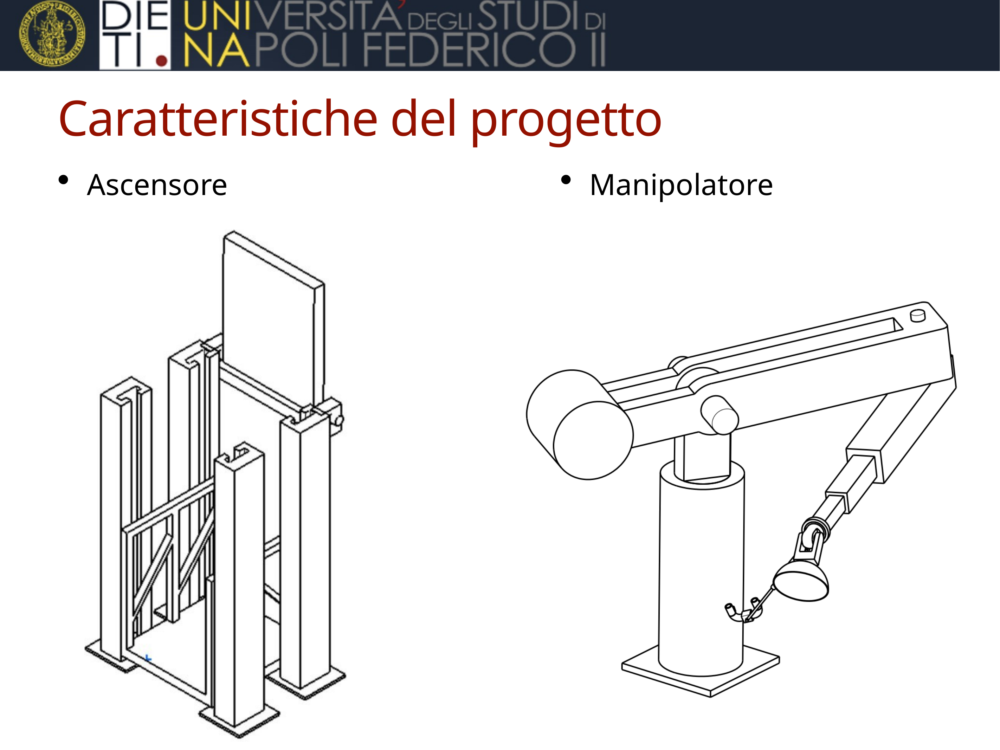
</p>

## Project at a glance 

- **Goal:** assist a human operator during maintenance tasks inside a mockup environment by providing **safe access** and **robust handling** of First Wall modules.
- **Payload requirement:** manipulator designed to sustain **up to 250 kg**.
- **Main subsystems:**
  - **Elevator platform** (operator lifting + ramp at end-of-stroke)
  - **Manipulator** (prismatic + revolute joints) with **suction-cup end-effector**
- **Activities:** CAD concept design, structural checks (FEA), kinematic checks, and ergonomic assessment.

---

## Context

Remote maintenance in fusion facilities often requires handling heavy components in constrained spaces. This project explores a **mechanical support system** (virtual prototype) to simplify operator access and the manipulation of First Wall modules.

<p align="center">
  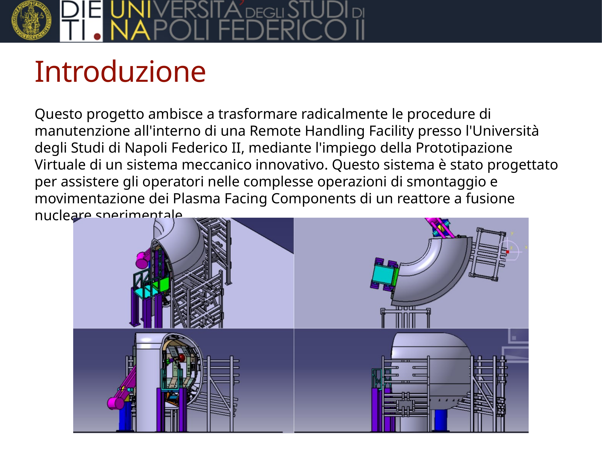
</p>

---

## Requirements

- Enable the worker to operate **inside the mockup environment**.
- Guarantee correct grasping/handling of **First Wall modules**:
  - 5 Outboard First Wall modules
  - 2 Inboard First Wall modules
  - 2 Top First Wall modules
- Provide **robustness** and **operator safety**.
- Manipulator must support a **maximum module mass of 250 kg**.

<p align="center">
  
</p>

---

## System architecture

The concept consists of two cooperating subsystems:

1. **Elevator** – brings the operator to the working height; a ramp is lowered at the end-stop to reach the walkable surface.
2. **Manipulator** – positioned near one torus access; the operator can reach and drive the end-effector from the platform.

<p align="center">
  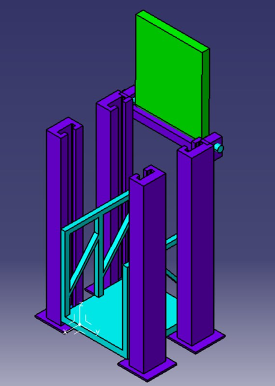
</p>

---

## Elevator

### Design

Bottom-up approach with the following main components:
- 4 supports
- 4 guides
- platform + guardrails
- bridge


### Structural analysis (FEA)

**Mesh settings**
- Global size: 50 mm (sagitta 10 mm)
- Local refinement at bridge joints: 5 mm

**Material**
- Steel

**Loads & boundary conditions**
- Vertical load applied downward at the center of an edge
- Load case: **10,000 N** (approx. 70 kg operator + toolbox + margin)
- Supports fixed to the ground

<p align="center">
  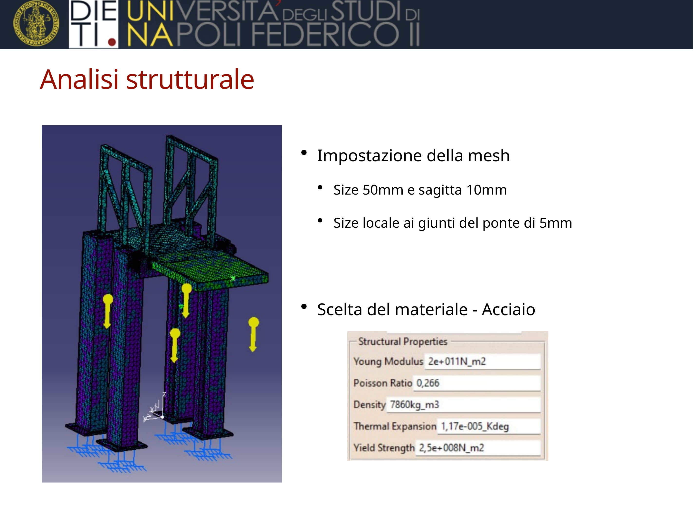
</p>
<p align="center">
  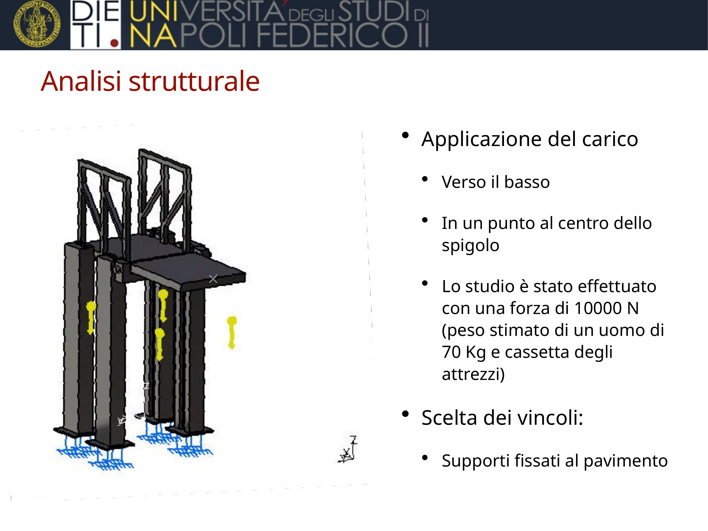
</p>
<p align="center">
  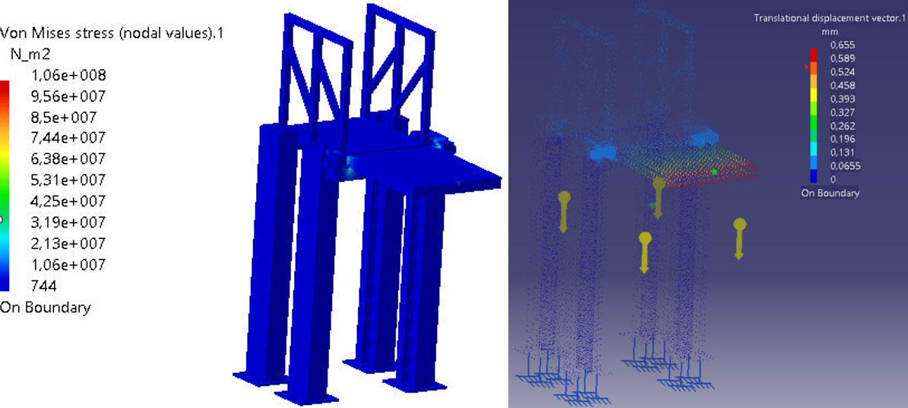
</p>

### Kinematics & footprint

<p align="center">
  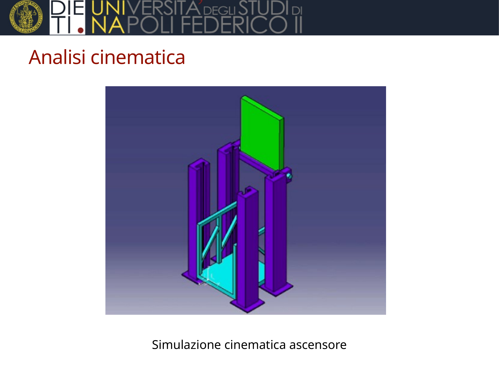
</p>
<p align="center">
  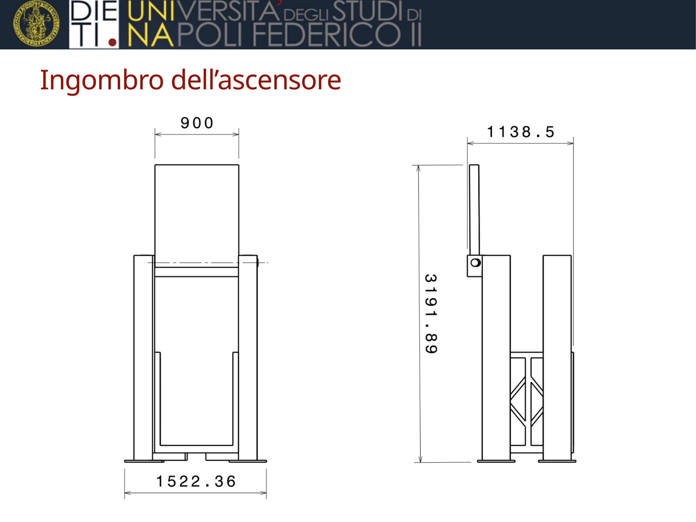
</p>

---

## Manipulator

### Design

- Installed close to one access of the torus.
- **End-effector** reachable from the platform; includes a **suction cup** for grasping.

**Kinematic chain**
- Fixed base
- 2 prismatic joints
- 3 revolute joints

**Operator interface**
- Spherical wrist
- Handlebar connected via spherical joint
- 2 cylindrical joints
- Throttle + brakes

<p align="center">
  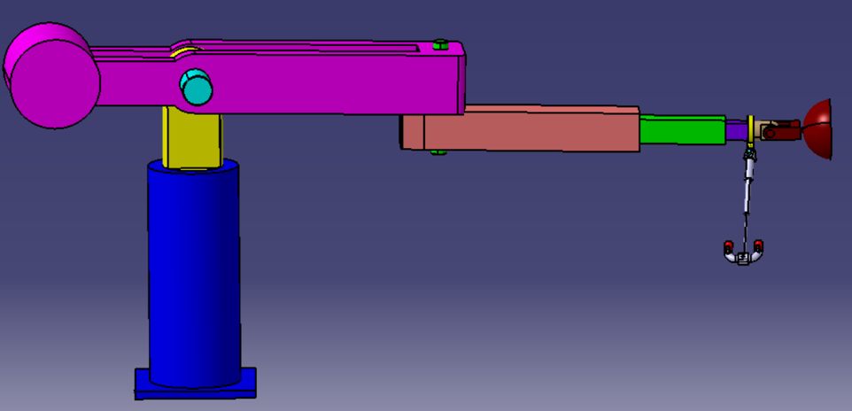
</p>
<p align="center">
  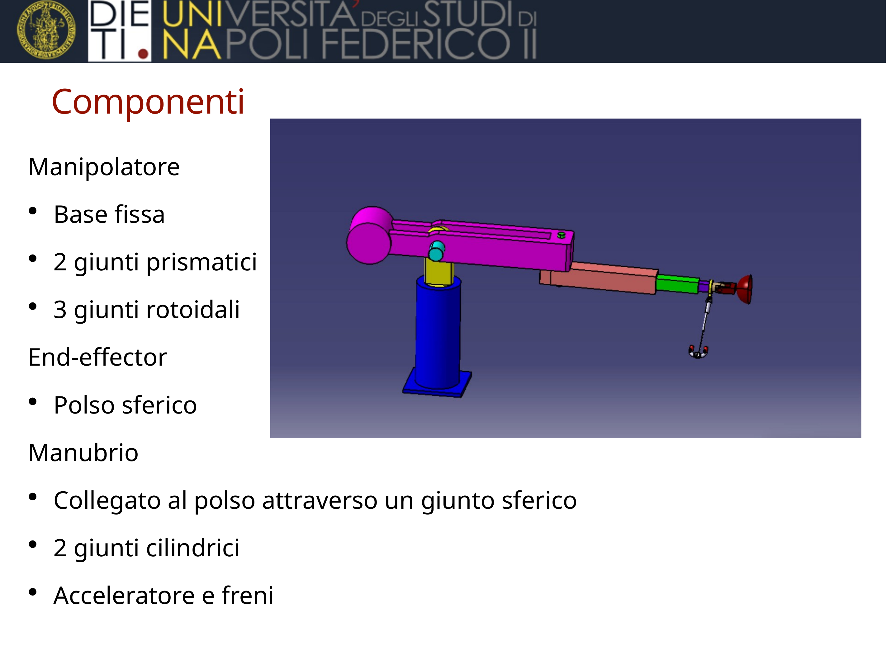
</p>

### Structural analysis (FEA)

**Mesh settings**
- Global size: 50 mm (sagitta 10 mm)
- Local refinement: 5 mm

**Material**
- Steel

**Loads & boundary conditions**
- Vertical load applied at the center of the suction cup
- Base fixed to the ground

**Load cases**
- **2,500 N** (≈ 250 kg module weight)
- **6,250 N** (overload scenario)

**Key observation (both cases)**
- Highest stress concentration occurs near the **prismatic joints**.
- Von Mises stress remains acceptable in the investigated scenarios.
- Maximum deflection occurs at the **end-effector** *(replace the placeholders below with your measured values from CATIA/FEA outputs).*

> **TODO (fill from your solver output):**
> - Max end-effector deflection @ 2,500 N: `__ mm`
> - Max end-effector deflection @ 6,250 N: `__ mm`

<p align="center">
  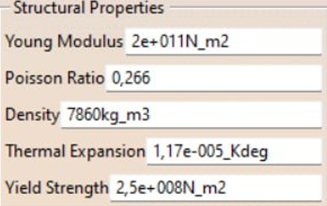
</p>
<p align="center">
  
</p>

---

## Ergonomic assessment

An SSP-based evaluation indicates that the joints under the highest load are the **left knee** and **left hip**, especially during the final phase of the simulation when the mannequin climbs the platform to avoid stepping on the divertor.

> **Suggested image:** export an ergonomics screenshot (SSP output) and save it as `assets/images/ergonomics_ssp.png`, then embed it here:

```md

